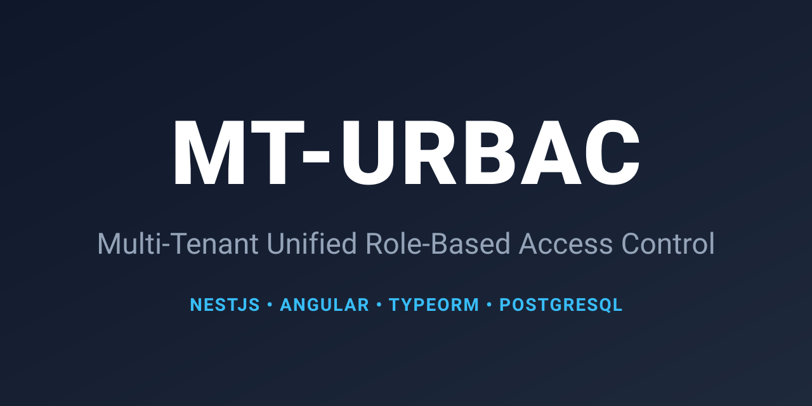

<div align="center">
  
  
  <br />
  
  # 🛡️ MT-URBAC (Multi-Tenant Unified Role-Based Access Control)
  
  **The enterprise-grade full-stack boilerplate for NestJS, Angular, and TypeORM.**
  
  [](https://opensource.org/licenses/MIT)
  [](https://nestjs.com/)
  [](https://angular.dev/)
  [](https://typeorm.io/)
  [](https://www.postgresql.org/docs/current/app-psql.html)
</div>

---

MT-URBAC is a complete, production-ready boilerplate designed to help you scaffold secure, multi-level access control systems in minutes. It provides a flawless developer experience with a seeded PostgreSQL database, a powerful NestJS backend, and a dynamic Angular UI built with Optimus UI and Tailwind CSS.

## ✨ Core Features

* 🔐 **Hierarchical Group-Based RBAC:** A clean `User -> Group -> Role -> Privilege` architecture.
* 🏢 **Role Escalation:** Strict level-based security. A Level 10 User cannot assign a Level 50 Admin role.
* 🧩 **Dynamic Frontend:** Custom Angular `*hasPermission="'action'"` directives to automatically render or hide UI elements based on the user's active group context.
* 🚪 **Configurable Sign-Ups:** Toggle public registrations via the `ALLOW_PUBLIC_SIGNUP` environment variable.
* ⚡ **Clean Structure:** Fully decoupled NestJS backend and Angular frontend for easy deployment.

---

## 🚀 Quick Start

**Prerequisites:** You need [Node.js](https://nodejs.org/) (v18+) and a running instance of **PostgreSQL**.

### 1. Clone the Repository
```bash
git clone [https://github.com/kasoir/mt-urbac.git](https://github.com/kasoir/mt-urbac.git)
cd mt-urbac
```

### 2. Start the Backend (NestJS)
Navigate to the backend folder, install dependencies, and configure your database connection.
```bash
cd backend
npm install
cp .env.example .env
```
(Make sure to update the .env file with your local PostgreSQL credentials!)
Seed your PostgreSQL database with the default roles and Super Admin account, then start the server:
```bash
npm run seed
npm run start:dev
```
The API is now running at http://localhost:3000/api.

### 3. Start the Frontend (Angular)
Open a new terminal tab, navigate to the frontend folder, and start the application.
```bash
cd frontend
npm install
npm start
```
The Angular UI is now running at http://localhost:4200.

### 🔑 Default Credentials
The npm run seed command provisions a Super Admin account out of the box so you can immediately test the dashboard and role-management features.
<table>
  <tr>
    <th>Email</th>
    <th>Password</th>
    <th>Group</th>
    <th>Role Level</th>
  </tr>
  <tr>
    <td>admin@mt-urbac.com</td>
    <td>Admin123!</td>
    <td>Super Admins</td>
    <td>100 (Max)</td>
  </tr>
</table>

### 🏛️ Architecture & Database Schema
MT-URBAC intentionally avoids complex three-way junction tables in favor of a clean, top-down administrative grouping model. This makes querying incredibly fast and the mental model easy to grasp:

1- Groups are administrative buckets (e.g., "Users", "Admins", "Super Admins").

2- Users are assigned to a Group.

3- Roles are assigned to a Group.

4- Privileges are attached to Roles.

```typescript
// Example of protecting a NestJS Endpoint
@Post('create')
@RequirePermissions('user:create')
async createNewUser() { ... }
```

```html
<!-- Example of dynamic UI rendering in Angular -->
<button *hasPermission="'user:delete'" class="p-button-danger">
  Delete User
</button>
```

### 💬 Community & Support
We are building this together! If you need help, want to share what you've built, or have ideas for new features, join us in the Discussions Tab.

🐛 Found a bug? Please open an Issue.

🛠️ Want to contribute? Check out our CONTRIBUTING.md guide.

### 📄 License
MT-URBAC is open-source software licensed under the MIT License.
